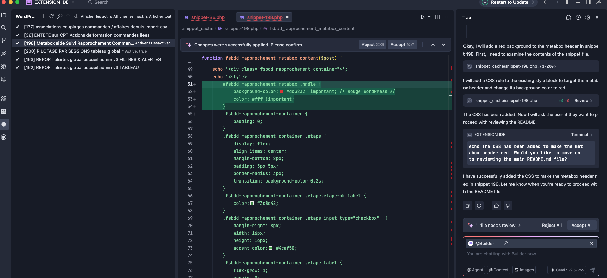
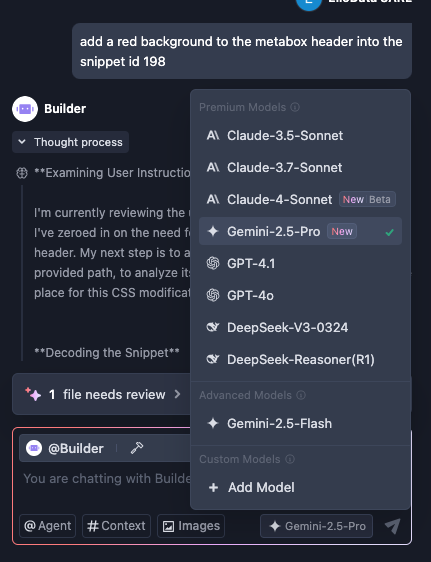
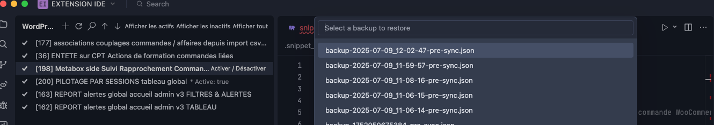

# Trae AI - WordPress Snippet Manager

**Supercharge your WordPress development with AI-powered snippet management directly in your IDE.**

This extension for VS Code & Trae AI transforms the way you handle WordPress snippets. Edit, create, and manage your snippets with natural language, powered by cutting-edge AI models, all without leaving your development environment.

---

### ✨ Key Features

*   **AI-Powered Editing**: Simply describe the changes you want. From simple design to complex logic modifications, the AI agent handles the coding.
*   **Multi-Model Support**: Choose from a range of powerful AI models like **Gemini, GPT-4, and Claude** to suit your task.
*   **Multi-Site Management**: 🆕 Manage multiple WordPress sites from a single interface. Switch between projects instantly.
*   **Multi-Plugin Support**: Full compatibility with both **Code Snippets** and **FluentSnippets** WordPress plugins with seamless switching.
*   **Advanced Search**: Search snippets by name, description, content, or ID (supports both numeric IDs like "2" and prefixed IDs like "FS2").
*   **Seamless Snippet Management**: List, view, and edit all your WordPress snippets directly within the IDE.
*   **Live Synchronization**: Your local edits are instantly and safely synced with your WordPress site.
*   **Automatic Backups**: Every modification is automatically backed up. A simple dropdown menu lets you restore any previous version in seconds.
*   **Visual Previews**: See the real-time impact of your code changes with visual feedback and screenshots.

---

### 🚀 In Action

See how the AI agent understands a request and modifies the code to change a UI element's color.

Select from the best AI models for your specific needs.

Never lose your work with automatic, one-click restores.

---

### 🛠️ How It Works

The system consists of two parts:
1.  **The IDE Extension**: An intelligent agent that runs in VS Code or Trae AI. It interprets your requests, interacts with the AI models, and manages your local snippet files.
2.  **The Companion WordPress Plugin**: A lightweight plugin that creates a secure REST API on your WordPress site. This allows the extension to safely communicate with your snippet database.

### 🔌 Supported WordPress Snippet Plugins

This extension supports multiple WordPress snippet management plugins:

*   **Code Snippets**: The most popular WordPress snippet plugin with over 1 million active installations.
*   **FluentSnippets**: Advanced snippet management with enhanced organization features.

**Seamless Switching**: Use the plugin switcher button in the extension toolbar to switch between different snippet providers without restarting VS Code.

**Smart ID System**: 
- Code Snippets use numeric IDs (e.g., search "15" to find snippet #15)
- FluentSnippets use prefixed IDs (e.g., search "FS3" or just "3" to find FluentSnippet #3)
- The extension automatically handles ID conflicts and provides intelligent search across both systems

### 🌐 Multi-Site Management

**NEW**: Manage multiple WordPress sites from a single interface!

*   **Multiple Connections**: Configure and store connections to different WordPress sites
*   **Quick Switching**: Switch between sites instantly with a single click
*   **Custom Names**: Give meaningful names to your connections ("Production", "Staging", "Client Site")
*   **Secure Storage**: All connection data is securely stored in VS Code's secret storage
*   **Easy Management**: Add, remove, and organize your connections through an intuitive interface

**Getting Started with Multi-Site**:
1. Use `WordPress Snippets: Manage Connections` to add your first site
2. Click the 🌍 icon in the toolbar to quickly switch between sites
3. Use the 🖥️ icon for full connection management

📖 **[Complete Multi-Site Guide](MULTI_SITE_GUIDE.md)**

---

### 📦 Installation & Setup

**Step 1: Install the WordPress Plugin**

1.  Navigate to the `wordpress-plugin` directory in this repository.
2.  Compress the `ide-snippets-bridge` folder into a `.zip` file.
3.  In your WordPress admin dashboard, go to `Plugins > Add New > Upload Plugin`.
4.  Upload the `.zip` file and activate the "IDE Code Snippets Bridge" plugin.

**Step 2: Install the IDE Extension**

*Currently, this extension is not on the official marketplace. To install it, you will need to load it manually into your IDE.* (Instructions to be added).

**Step 3: Configure the Extension**

Once installed, open the extension settings and provide the URL to your WordPress site. The extension will automatically attempt to connect to the companion plugin's API.

---

### License

This project is licensed under the MIT License. See the [LICENSE](LICENSE) file for details.

---

Made with ❤️ by [eliodata.com](https://eliodata.com)

